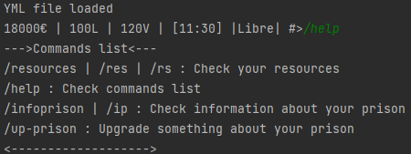

# pyHebs

<h4>This Python project is a Prison game that is played on the Python console. The game is easy to export, your game data is kept in the "data" folder. Enjoy the game.</h4> 
<u>List of commands for now:</u> 
           - /resources | /res | /rs : Check your resources 
           - /help : Check commands list 
           - /infoprison | /ip : Check information about your prison 
           - /up-prison : Upgrade something about your prison  

